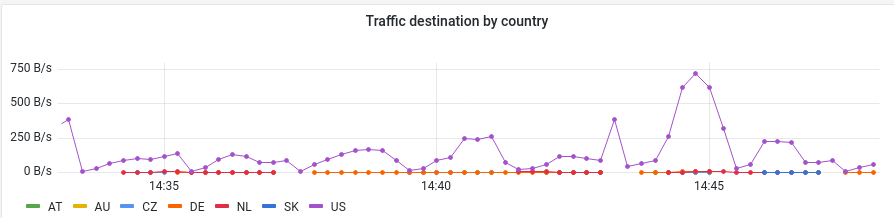
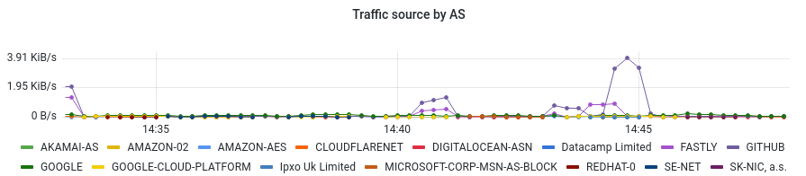

# Netflow exporter

Have you ever wondered where is your internet traffic going?





## How it works

Simply put, it uses netflow protocol, specifically it uses V5 version for simplicity.
In order for your setup to work, you will either need [nfdump](https://github.com/phaag/nfdump)
or dedicated hardware such as [Mikrotik RB941](https://mikrotik.com/product/RB941-2nD)
Flows are then fed into collector that aggregates them as metrics.
Geolocation info is gathered from Maxmind GeoIP Lite database.
Necessary files can be obtained on RHEL OS (or similar) with `sudo dnf install geolite2-country geolite2-asn` 


Example configuration for routerboard
```
/ip traffic-flow
set enabled=yes interfaces=wan,bridge1
/ip traffic-flow target
add dst-address=192.168.0.10 port=30000 version=5
```

_Note `192.168.0.10` is address of machine where exporter is running_

## Configurable metrics

Flows are aggregated into metrics in fully configurable manner.

Example metric
```yaml
  - name: traffic_detail
    description: Traffic detail
    labels:
      - name: sampler
        value: sampler
        converter: ipv4
      - name: protocol
        value: proto_name
        converter: str
      - name: source_country
        value: source_country
        converter: str
      - name: destination_asn_org
        value: destination_asn_org
        converter: str
```

Full example can be found [here](docs/config.yaml)

## Run using podman/docker

```bash
podman run -ti -p 30000:30000/udp -p 30001:30001/tcp -u 1000 \
  -v $(pwd)/config.yaml:/config.yaml:ro \
  -v /usr/share/GeoIP:/usr/share/GeoIP:ro \
  ghcr.io/rkosegi/netflow-collector:latest
```
